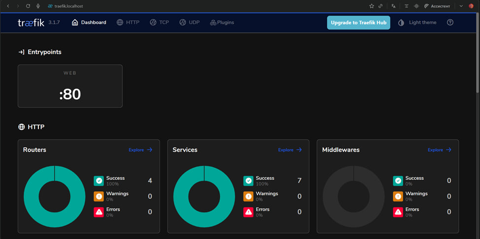
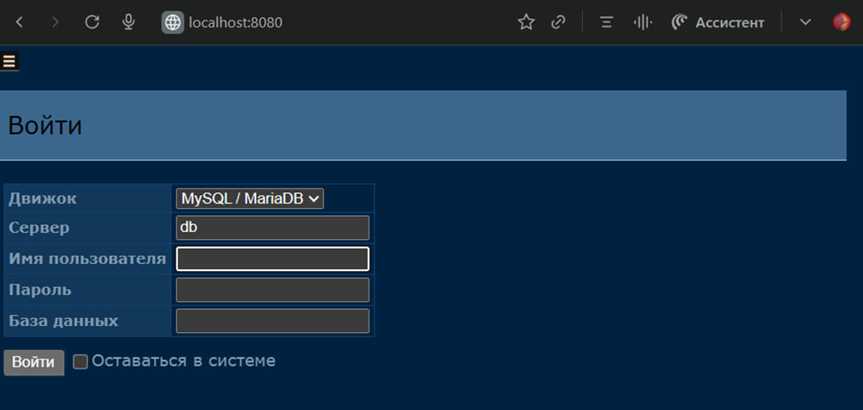
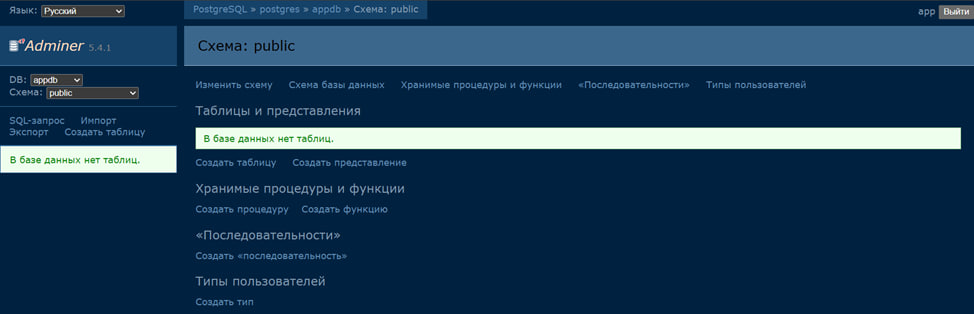
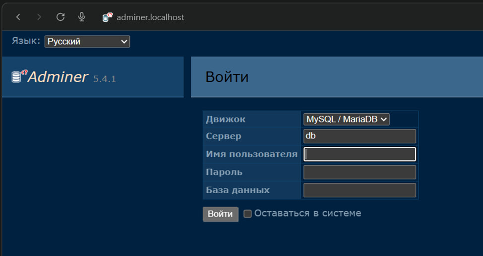

# tmp-lab2
Отчет по настройке Docker окружения

### Шаг 0. Подготовка файлов

Я скопировал файлы из `materials/starter/` в папку `work`.

Проверяем содержимое папки:

```bash
nikita@DESKTOP-K9L6F97:~/work$ ls -la
total 48
drwxr-xr-x 5 nikita nikita 4096 Nov 22 09:19 .
drwxr-x--- 19 nikita nikita 4096 Nov 22 09:11 ..
-rw-r--r-- 1 nikita nikita  632 Nov 22 09:16 .env
-rw-r--r-- 1 nikita nikita  601 Nov 22 09:15 Dockerfile
-rw-r--r-- 1 nikita nikita  519 Nov 22 09:15 Makefile
drwxr-xr-x 2 nikita nikita 4096 Nov 22 09:15 app
-rw-r--r-- 1 nikita nikita 1153 Nov 22 09:15 docker-compose.observability.yml
-rw-r--r-- 1 nikita nikita  625 Nov 22 09:15 docker-compose.security.yml
-rw-r--r-- 1 nikita nikita 1949 Nov 22 09:15 docker-compose.yml
drwxr-xr-x 3 nikita nikita 4096 Nov 22 09:15 observability
-rw-r--r-- 1 nikita nikita   87 Nov 22 09:15 requirements.txt
drwxr-xr-x 2 nikita nikita 4096 Nov 22 09:15 scripts
```

-----

### Шаг 1. Сборка и запуск

Запускаем сборку контейнеров:

```bash
nikita@DESKTOP-K9L6F97:~/work$ docker compose up -d --build
WARN[0000] /home/nikita/work/docker-compose.yml: the attribute `version` is obsolete...
[+] Running 0/5
 : rabbitmq Pulling                                       3.1s
 : postgres Pulling                                       3.1s
 : adminer Pulling                                        3.1s
 : redis Pulling                                          3.1s
 : traefik Pulling                                        3.1s
```

И вот, как мы видим, у нас всё четко запустилось и работает (проверка через curl):

```json
nikita@DESKTOP-K9L6F97:~/work$ curl -s http://api.localhost/healthz
{"status":"ok"}
nikita@DESKTOP-K9L6F97:~/work$ curl -s http://api.localhost/db
{"db":1}
nikita@DESKTOP-K9L6F97:~/work$ curl -s http://api.localhost/cache
{"cache":"ok"}
```

-----

### Шаг 2. Проверка Traefik

Traefik доступен через веб-интерфейс:



-----

### Шаг 3. Настройка доступа к Adminer

Появилась проблема с тем, что adminer был недоступен по адресу `adminer.localhost`. Я залез в файл `docker-compose.yml` и увидел, что у контейнера `adminer` не прописан `ports`.

После того, как я прописал порты, я смог перейти по `localhost:8080` и попасть на Adminer:



Получилось зайти в базу данных:



-----

### Шаг 4. Настройка домена adminer.localhost

Я хочу, чтобы Adminer был доступен по красивому адресу `adminer.localhost`, а не через порт. Для этого я добавил конфигурацию лейблов для Traefik.

В `docker-compose.yml` (секция adminer):

```yaml
adminer:
  image: adminer:latest
  networks: [public, backend]
  labels:
    - traefik.enable=true
    - traefik.http.routers.adminer.rule=Host(`adminer.localhost`)
    - traefik.http.services.adminer.loadbalancer.server.port=8080
    - traefik.docker.network=elite-stack_public
```

После добавления этой строчки (`traefik.docker.network=elite-stack_public`), я смог перейти по адресу `adminer.localhost`:


-----

### Шаг 5. Чек-лист

### 1. Работоспособность API
- [x] API отвечает со статусом 200 OK по адресу `/healthz`
- [x] API корректно работает с базой данных (`/db`)
- [x] API корректно работает с кэшем (`/cache`)

### 2. Состояние контейнеров
- [x] Команда `docker compose ps` показывает статус `healthy` или `running` для всех сервисов

### 3. Маршрутизация и доступность (Traefik)
- [x] Доступен API: http://api.localhost
- [x] Доступен Adminer: http://adminer.localhost
- [x] Доступен дашборд Traefik: http://traefik.localhost

### 4. Оптимизация и безопасность
- [ ] Размер итогового образа приложения ≤ 200MB
- [x] Процессы внутри контейнеров запущены от `non-root` пользователя

### 5. Конфигурация и Git
- [x] В репозитории **отсутствуют** пароли и DSN в явном виде
- [x] Создан файл `.env.example` для примера конфигурации
